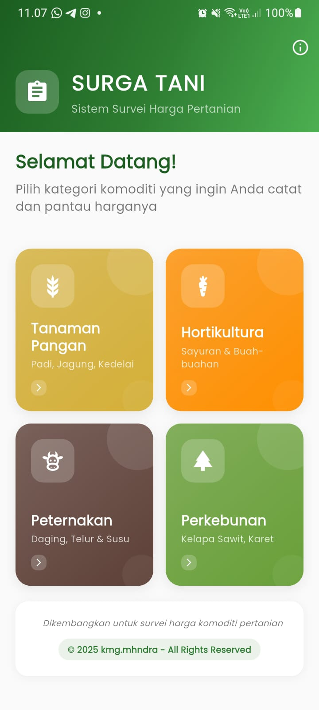
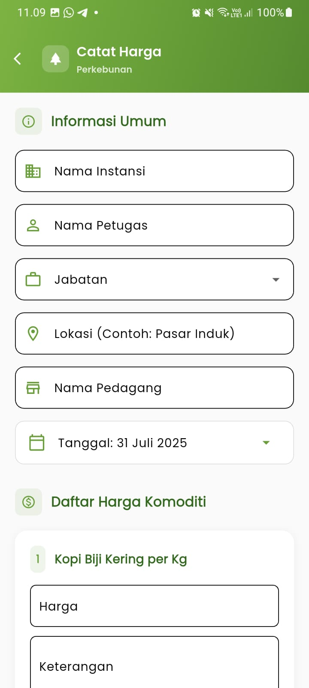
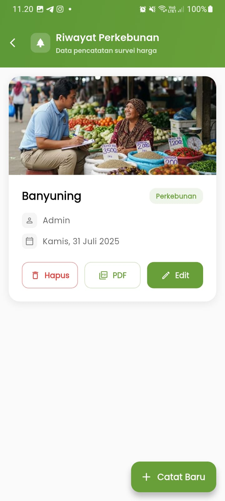

# 🌾 SURGA TANI
### *Survei Harga Pertanian - Smart Agricultural Price Survey*

<p align="center">
  
  
  
  
  
</p>

<p align="center">
  <strong>Aplikasi mobile Flutter untuk survei dan pencatatan harga komoditi pertanian yang efisien dan akurat</strong>
</p>

---

## 📱 Preview Aplikasi

<p align="center">
  
  
  
</p>

## 🎯 Tentang Proyek

**SURGA TANI** adalah solusi digital yang dirancang khusus untuk petugas lapangan dalam melakukan survei harga komoditi pertanian. Aplikasi ini mengoptimalkan proses pencatatan data dengan interface yang intuitif dan fitur-fitur canggih untuk dokumentasi yang komprehensif.

### 🚀 Keunggulan Utama
- **Efisiensi Tinggi**: Interface yang dirancang untuk kecepatan input data di lapangan
- **Fleksibilitas**: Mendukung berbagai subsektor pertanian dengan form yang adaptif
- **Dokumentasi Visual**: Integrasi kamera untuk bukti visual yang kuat
- **Laporan Profesional**: Export PDF dengan format standar dan lengkap
- **Offline Ready**: Bekerja tanpa koneksi internet dengan database lokal

---

## ✨ Fitur Unggulan

### 🎛️ **Dashboard Multi-Kategori**
Antarmuka utama yang memberikan akses cepat ke berbagai subsektor:
- 🌾 **Tanaman Pangan** - Padi, jagung, kedelai, dan komoditi pangan lainnya
- 🍎 **Hortikultura** - Buah-buahan, sayuran, dan tanaman hias
- 🐄 **Peternakan** - Ternak besar, unggas, dan produk peternakan
- 🌴 **Perkebunan** - Kelapa sawit, karet, kopi, dan komoditi perkebunan

### 📝 **Form Input Dinamis**
- Form yang disesuaikan untuk setiap kategori komoditi
- Support untuk item dengan sub-kategori (khusus peternakan)
- Validasi data real-time
- Auto-save untuk mencegah kehilangan data

### ➕ **Manajemen Komoditi Fleksibel**
- Daftar komoditi yang dapat disesuaikan
- Kemampuan menambah item baru on-the-fly
- Pencarian dan filter komoditi yang cepat

### 📷 **Dokumentasi Visual**
- Upload multiple foto per catatan
- Kompresi otomatis untuk optimasi storage
- Preview gambar sebelum menyimpan
- Watermark otomatis dengan timestamp

### 💾 **Penyimpanan Data Robust**
- Database Hive untuk performa tinggi
- Sinkronisasi data yang aman
- Backup dan restore data
- Enkripsi data sensitif

### 📄 **Laporan PDF Professional**
- Template laporan yang dapat dikustomisasi
- Kop surat dan header resmi
- Tanda tangan digital
- Lampiran foto terintegrasi
- Export batch untuk multiple records

---

## 🛠️ Tech Stack

| Kategori | Teknologi |
|----------|-----------|
| **Framework** | Flutter 3.x |
| **Bahasa** | Dart 3.0+ |
| **Database** | Hive (NoSQL Local) |
| **State Management** | Provider + StatefulWidget |
| **PDF Generation** | pdf + printing |
| **Image Handling** | image_picker |
| **UI/UX** | Material Design 3 |
| **Notifications** | top_snackbar_flutter |
| **Icons** | flutter_launcher_icons |
| **Internationalization** | intl |

---

## 🚀 Quick Start

### Prerequisites
Pastikan Anda telah menginstal:
- [Flutter SDK](https://flutter.dev/docs/get-started/install) (versi 3.x)
- [Dart SDK](https://dart.dev/get-dart) (versi 3.0+)
- Android Studio atau VS Code dengan Flutter extension
- Emulator Android/iOS atau perangkat fisik

### Installation

1. **Clone Repository**
   ```bash
   git clone https://github.com/[username]/surga_tani.git
   cd surga_tani
   ```

2. **Install Dependencies**
   ```bash
   flutter pub get
   ```

3. **Generate Hive Adapters**
   ```bash
   dart run build_runner build --delete-conflicting-outputs
   ```

4. **Run Application**
   ```bash
   flutter run
   ```

### Build Release

```bash
# Android APK
flutter build apk --release

# Android App Bundle
flutter build appbundle --release

# iOS
flutter build ios --release
```

---

## 📂 Arsitektur Proyek

```
lib/
├── 📁 models/                    # Data models & Hive adapters
│   ├── tanaman_pangan_model.dart
│   ├── hortikultura_model.dart
│   ├── peternakan_model.dart
│   └── perkebunan_model.dart
├── 📁 providers/                 # State management
│   └── form_provider.dart
├── 📁 screens/                   # UI Screens
│   ├── 🏠 home_screen.dart
│   ├── 📋 record_list_screen.dart
│   ├── 📝 form_screens/
│   └── 🔍 detail_screens/
├── 📁 services/                  # Business logic
│   ├── pdf_service.dart
│   ├── database_service.dart
│   └── image_service.dart
├── 📁 utils/                     # Utilities & constants
│   ├── theme.dart
│   ├── constants.dart
│   └── helpers.dart
├── 📁 widgets/                   # Reusable components
└── 📄 main.dart                  # Entry point
```

---

## 🤝 Contributing

Kami sangat menghargai kontribusi dari komunitas! Berikut cara berkontribusi:

1. **Fork** repository ini
2. **Create** feature branch (`git checkout -b feature/AmazingFeature`)
3. **Commit** perubahan (`git commit -m 'Add: Amazing Feature'`)
4. **Push** ke branch (`git push origin feature/AmazingFeature`)
5. **Open** Pull Request

### Development Guidelines
- Ikuti [Flutter Style Guide](https://dart.dev/guides/language/effective-dart/style)
- Pastikan semua test pass sebelum submit PR
- Sertakan dokumentasi untuk fitur baru
- Update CHANGELOG.md untuk perubahan signifikan

---

## 📋 Roadmap

- [ ] **v2.0** - Cloud sync & multi-user support
- [ ] **v2.1** - Advanced analytics & reporting
- [ ] **v2.2** - API integration untuk data nasional
- [ ] **v2.3** - Machine learning price prediction
- [ ] **v2.4** - Real-time collaboration tools

---

## 📄 License

Proyek ini dilisensikan di bawah **MIT License**. Lihat [LICENSE](LICENSE) untuk detail lengkap.

---

## 👥 Tim Pengembang

<p align="center">
  <strong>Dikembangkan dengan ❤️ untuk kemajuan pertanian Indonesia</strong>
</p>

<p align="center">
  <a href="https://github.com/[username]">
    
  </a>
  <a href="mailto:contact@example.com">
    
  </a>
</p>

---

<p align="center">
  <sub>© 2025 SURGA TANI. All rights reserved.</sub>
</p>